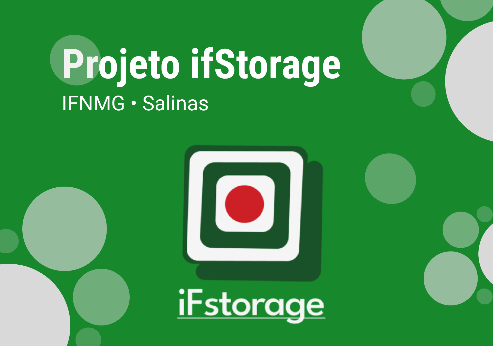
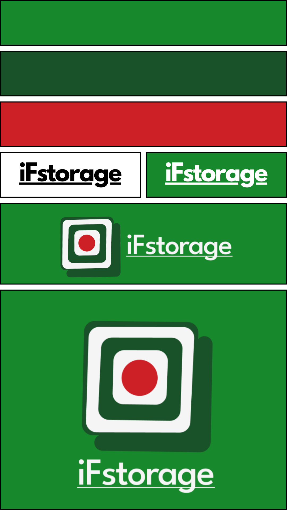
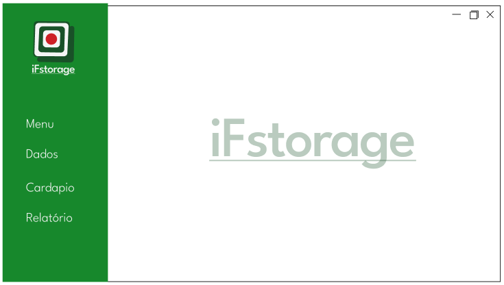
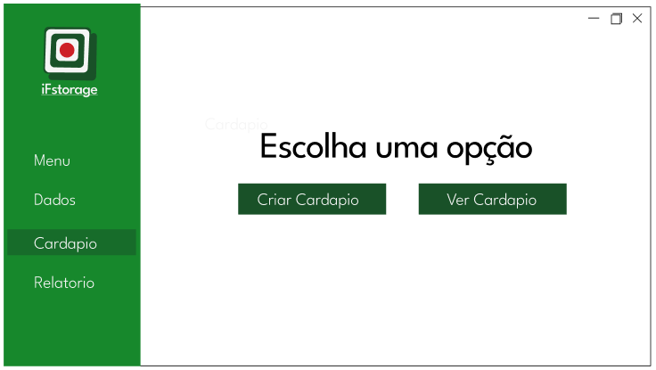

<h1 align="center"> iFstorage3 </h1>

  Esse projeto está sendo desenvolvido com o objetivo de atender a uma demanda do Setor de alimentação e nutrição SAN  

  &nbsp;&nbsp;&nbsp;|&nbsp;&nbsp;&nbsp;
  &nbsp;&nbsp;&nbsp;|&nbsp;&nbsp;&nbsp;
  &nbsp;&nbsp;&nbsp;|&nbsp;&nbsp;&nbsp;
  &nbsp;&nbsp;&nbsp;|&nbsp;&nbsp;&nbsp;

  

  

## Design

Durante o processo de desenvolvimento da identidade visual do sistema, surgiu a brilhante ideia de explorar a possibilidade de sua utilização por outras instituições. Foi nesse momento que nos empenhamos em criar uma identidade visual que não só refletisse a essência do IFNMG, mas também pudesse ser facilmente adaptada e adotada por diferentes organizações.

Nesse sentido, buscamos estabelecer uma conexão visual com o IFNMG, valendo-nos das mesmas cores e padrões visuais presentes em sua identidade visual original. Acreditamos que isso não apenas ajudaria a reforçar a associação com a instituição, mas também facilitaria a identificação do sistema por parte dos usuários, criando uma sensação de familiaridade.

Quanto ao nome, foi um processo longo e minucioso de discussões e considerações. Dentre várias opções, chegamos à escolha final: "iFstorage". Essa combinação engenhosa do acrônimo "iF", representando o símbolo da instituição, com a palavra "storage", de origem inglesa e que remete a "armazenamento" ou "depósito", captura a essência do sistema de forma concisa e impactante. Optamos pelo uso do inglês por motivos estéticos, uma vez que a língua inglesa é amplamente reconhecida e possui uma sonoridade que soa agradável ao ouvido.

É importante ressaltar que a escolha da palavra em inglês também se deve à estreita relação entre o sistema e o setor de depósito da instituição. Grande parte das informações que alimentam o sistema são provenientes desse setor, tornando-o um elemento crucial na operação e funcionalidade do sistema. Assim, a palavra "storage" não só reflete essa relação intrínseca, mas também transmite um senso de organização, segurança e confiabilidade.
Dando continuidade à construção da identidade visual, a logo também foi concebida com um objetivo claro em mente. Indiretamente, buscamos fazer referência ao conceito de depósito, representando uma caixa que contém em seu interior a letra "i", elemento distintivo e reconhecido do logotipo do IFNMG. Essa abordagem sutil permite que a logo seja interpretada de diferentes maneiras, gerando múltiplas perspectivas e sentidos, dependendo da percepção e contexto de cada pessoa.

Por fim, as cores desempenham um papel fundamental na criação da identidade visual do sistema. Decidimos utilizar as cores que representam o IFNMG, as quais consistem em duas variações de verde (uma mais escura e outra mais clara), branco e vermelho. Essas cores foram selecionadas cuidadosamente, diretamente do site oficial da instituição, a fim de garantir a coesão e harmonia visual com a marca do IFNMG.

Em suma, o processo de desenvolvimento da identidade visual do sistema foi permeado por discussões e reflexões sobre como transmitir a essência do IFNMG e garantir sua adaptabilidade para outras instituições. A escolha do nome "IFstorage" e a criação de uma logo que remete ao conceito de depósito, juntamente com o uso das cores oficiais do IFNMG, compõem uma identidade visual que é ao mesmo tempo distintiva, representativa e flexível.

  

  Imagem que representa as cores, logo e nome utilizados no sistema. 
   Fonte: Os Autores.

## Design das Telas

O sistema IFstorage foi cuidadosamente projetado com uma abordagem centrada no usuário, visando proporcionar uma experiência interativa e agradável por meio de seus diversos frames ou telas. Essa abordagem visa garantir que o usuário possa utilizar o sistema de forma intuitiva, evitando qualquer sensação de desorientação durante sua navegação.

No intuito de desenvolver uma interface que atendesse a esses objetivos, a equipe responsável pelo projeto realizou uma extensa pesquisa acerca dos JFrames, os elementos essenciais para o desenvolvimento das telas em Java. Durante essa pesquisa, foram identificadas algumas limitações inerentes à linguagem Java em relação ao design e à criação de interfaces gráficas.

Conscientes dessas limitações, a equipe decidiu ampliar suas pesquisas para buscar modelos de telas já desenvolvidas em Java, que pudessem servir de inspiração e referência para o projeto. Dessa forma, buscaram explorar soluções existentes e adaptá-las às necessidades específicas do IFstorage.

Após a fase de pesquisa e coleta de referências, deu-se início ao processo criativo de design das telas do sistema. Utilizando as cores definidas para o projeto, a equipe trabalhou minuciosamente no desenvolvimento de layouts que transmitisse efetivamente a identidade visual desejada. Para facilitar e agilizar esse processo, optou-se pelo uso da plataforma Figma, uma poderosa ferramenta de design que permite a criação de interfaces gráficas de forma ágil e colaborativa.

Por meio do Figma, foram criados wireframes e protótipos que passaram por um rigoroso processo de iterações e refinamentos. Cada elemento da interface foi cuidadosamente projetado levando em consideração a usabilidade, a acessibilidade e a estética, com o objetivo de oferecer ao usuário uma experiência agradável e intuitiva durante a interação com o sistema IFstorage.

Em resumo, o desenvolvimento do design das telas do sistema IFstorage envolveu um trabalho minucioso e abrangente, desde a pesquisa inicial sobre JFrames até a criação de protótipos refinados no Figma. A equipe se empenhou em superar as limitações da linguagem Java, buscando inspiração em modelos existentes para desenvolver uma interface atraente, funcional e adaptada às necessidades do projeto. O resultado é um conjunto de telas projetadas com atenção aos detalhes, visando proporcionar aos usuários uma experiência fluida e agradável ao utilizar o sistema IFstorage.

  
  

  Imagens exemplificativas do resultado do desenvolvimento das telas. 
  Fonte: Os Autores.

## Como executar o projeto?

<h3 align="center">
  Segue abaixo o passo a passo para execução sistema
</h3>

1. Verificar a versão do Java: O usuário precisa verificar se o Java está instalado em sua máquina. Eles podem fazer isso abrindo um prompt de comando ou terminal e digitando o comando java -version. Se o Java estiver instalado, a versão será exibida. Caso contrário, eles precisarão instalar o Java.

2. Instalar o Java: Se o Java não estiver instalado, o usuário pode acessar o site oficial da Oracle (www.oracle.com/java) e baixar a versão mais recente do Java Development Kit (JDK) adequada ao seu sistema operacional. Durante o processo de instalação, eles devem seguir as instruções fornecidas pela Oracle.

3. Obter o sistema Java: O cliente precisa obter o sistema Java que deseja executar. Isso geralmente é fornecido como um arquivo JAR (Java Archive) ou um pacote contendo todos os arquivos necessários que está dentro da pasta /target.

4. Executar o sistema: Uma vez que o cliente tenha o Java instalado e o sistema Java em mãos, eles podem executá-lo clicando duas vezes no arquivo JAR ou seguindo as instruções fornecidas pelo fornecedor do sistema. O Java será iniciado automaticamente e o sistema será executado na máquina do cliente.

